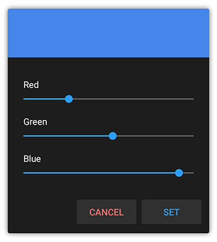

# colorpicker.java
Simple, lightweight and customizable color picker for your android app.

## Preview


## Implementation
1. Place color_picker_dialog.xml in your layout folder.
2. Place ColorPickerDialog.java in your java folder.
3. Replace package name in ColorPickerDialog.java to your app package.

## Usage
Open the color picker dialog
```java
ColorPickerDialog dialog = new ColorPickerDialog(initialColor);
dialog.show(getSupportFragmentManager(), "Color Picker");
```

Implement listener
```java
public class YourActivity extends AppCompatActivity implements ColorPickerDialog.setColorPickerListener {  
  @Override
  public void applyColor(int color) {
       //use this 'color' value in your code
       yourFunction(color);      
  }
}
```

:warning: Note: Make sure to configured the package name in java file correctly.
